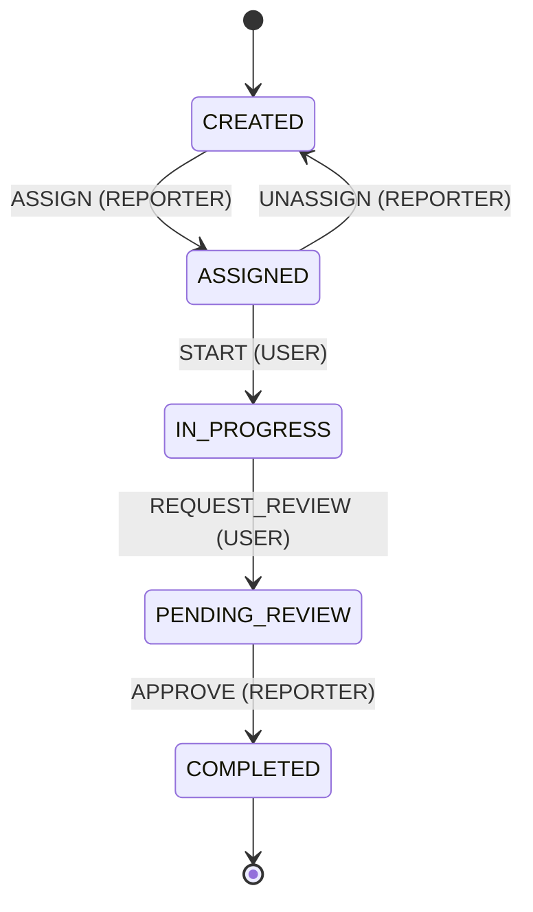
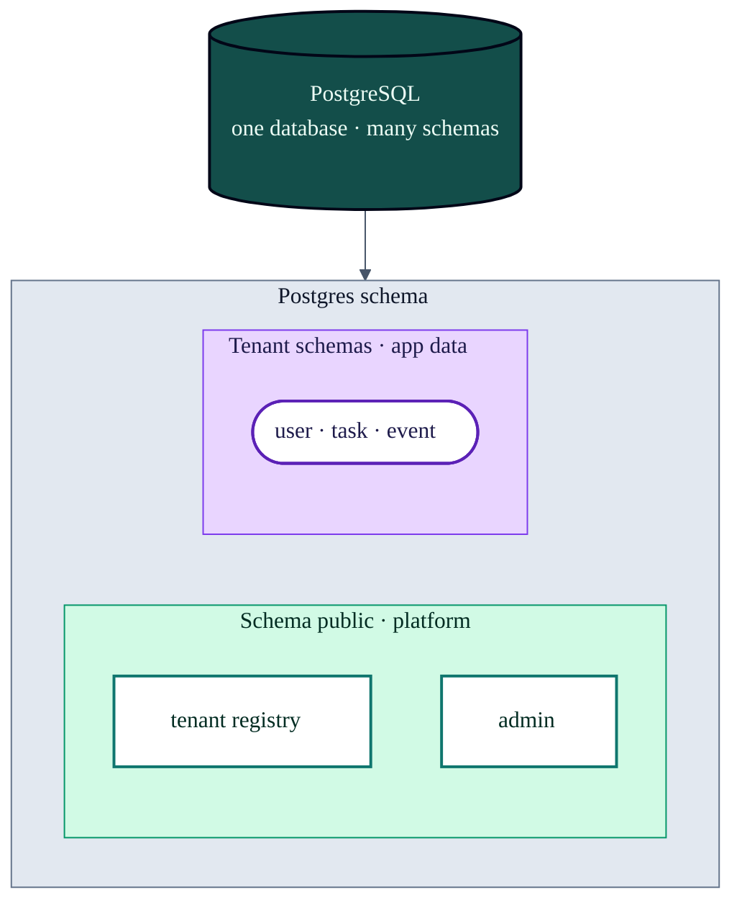

# Task Management Saas System (demo)

This project is a **demo** of a **multi-tenant** **task-management SaaS**: each tenant's data is isolated in its own **PostgreSQL schema** (the API resolves the schema from the `X-Tenant-Id` header; background jobs carry `tenantSchema` so workers stay on the right schema). Users and reporters manage tasks through a defined state machine, while the API stays thin by pushing heavy work to **background jobs**.

**Multi-tenancy**

HTTP handlers run inside MikroORM’s [`RequestContext`](https://mikro-orm.io/docs/identity-map#request-context): each request gets a **forked `EntityManager`** so the identity map stays isolated per request (no shared managed entities across concurrent calls). We pass the resolved PostgreSQL **schema** into that context and use **`orm.em.fork({ schema })`** where we inject a tenant-scoped manager, so all reads and writes hit the right tenant schema. BullMQ workers are not HTTP-bound, so they open an explicit **`em.fork({ schema })`** from the job payload instead.

**Asynchronous processing** uses **Redis** and **BullMQ**. The Compose **`worker`** service runs one Nest worker process that hosts both queue processors:

- **Task processor** — subscribes to `task-processing-queue`. It creates new tasks in the database from queued events, updates event status (`processing` → `completed` or `failed`), and hands off notification work to the mail queue. Failed jobs are retried with backoff; repeated failures are logged and can trigger a failure email.
- **Mail processor** — subscribes to `mail-processing-queue` and sends email (e.g. “task created” or “task creation failed”). With Docker Compose, **MailHog** receives mail so you can verify the flow without a real SMTP provider.

Together, this illustrates a typical pattern: **event → task creation → outbound mail**, all **off the HTTP request path**, **per tenant**, with retries and observability suitable for a reviewer walkthrough.

- **CQRS Pattern** — separates **commands** (writes) from **queries** (reads) so each side can evolve independently and stay focused on one responsibility.

## Architecture on BullMQ


---

## Task Management State machine

Transitions and allowed roles are defined in [`src/modules/task/state-machine/task.state-machine.ts`](src/modules/task/state-machine/task.state-machine.ts).



## Set up: Run the full flow (Docker only)

You need **Docker** and **Docker Compose**.

### 1. Env

```bash
cp .env.example .env
```

Defaults: API on host **3005** (`API_PUBLISH_PORT`), Postgres **5433**. If you change the port in `.env`, use it in the `curl` URLs below.

[**Swagger UI**](http://localhost:3005/api/docs/#)

**Multi-tenant (schema isolation):** the PostgreSQL **`public`** schema holds only the **tenant registry** and **management** authentication (`admin` table). Per-tenant app data (`user`, `task`, `event`, …) lives in **dedicated tenant schemas**. The API resolves a tenant schema from the `X-Tenant-Id` header on tenant routes; **management routes** (`/api/auth/admin/login`, `/api/tenant`) omit that header and run against `public`. Background workers read `tenantId` from each BullMQ job so processing stays on the correct schema.



### 2. Start everything

```bash
docker compose up -d --build
```

Services: `postgres`, `redis`, `mailhog`, `api`, `worker` (task + mail BullMQ processors).

### Explore the API in the browser (Swagger)

Access [Swagger API Doc](http://localhost:3005/api/docs#/)

### 3. Migrations (first time or empty DB)

**Public-schema migrations** (`src/database/migrations`) — a **single** migration (`Migration20260418000000_InitialPublicSchema`) creates `tenant` and `admin` in the PostgreSQL **`public`** schema (override with `PUBLIC_MIGRATION_SCHEMA` or `PUBLIC_SCHEMA` if needed). Run with `pnpm migration:up`.

**Per-tenant migrations** (`src/database/migrations-tenant`) create app tables (`event`, `user`, `task`, …) inside each tenant schema when you create or migrate tenants (`create-tenant`, `pnpm migrate:tenants`, etc.) via `getTenantMikroOrmConfig` in `mikro-orm.tenant.config.ts`.

```bash
pnpm migration:up
```

If you previously applied older public-schema migrations, **reset the DB** or reconcile `mikro_orm_migrations` in the `public` schema before switching to this single migration.

### 4. Seeding

**Management seeder:** `SchemaSeeder` seeds an **`admin`** row (default email `admin@assignment.local`; tune with `PUBLIC_ADMIN_*` in `.env`). Use the CLI when you only need that row:

```bash
pnpm exec mikro-orm seeder:run --class=SchemaSeeder
```

**Full demo (recommended):** Run `pnpm seed:database` after **`pnpm migration:up`**. It creates the **`demo`** tenant (override with **`SEED_DEMO_TENANT`** / **`DEMO_TENANT_SCHEMA`**), migrates it, registers it in **`public.tenant`**, runs **`SchemaSeeder`** (management admin) and **`DatabaseSeeder`** (demo users and tasks).

```bash
pnpm seed:database
```

**New tenant:** After you create a tenant (e.g. `POST /api/tenant`), seed that schema’s demo users and tasks:

```bash
pnpm run seed:tenant <tenant-schema-name>
```

Use the same tenant id you send as **`X-Tenant-Id`** (lowercase; hyphens become underscores in the schema name).


**Users** (passwords are for local use only):

**Public schema (management)** — only this account exists in `public`. Log in at `/api/auth/admin/login` (no `X-Tenant-Id`). Management JWTs cannot access tenant routes (tasks, tenant login, etc.).

| Email                    | Password                                      | Role    |
| ------------------------ | --------------------------------------------- | ------- |
| `admin@assignment.local` | `Admin123!@#` (or `PUBLIC_ADMIN_PASSWORD`) | `ADMIN` |

**Demo tenant** — `USER` / `REPORTER` seed users live in the tenant schema (e.g. `demo` after `pnpm seed:database`). Use `/api/auth/login` with `X-Tenant-Id` matching that tenant.

| Email                       | Password         | Role       |
| --------------------------- | ---------------- | ---------- |
| `user@assignment.local`     | `User123!@#`     | `USER`     |
| `reporter@assignment.local` | `Reporter123!@#` | `REPORTER` |

Or you can register you own account

```bash
curl --location 'http://localhost:3005/api/auth/register' \
--header 'Content-Type: application/json' \
--header 'x-tenant-Id: demo' \
--data-raw '{
    "email": Goldenowl@gmail.com",
    "password": "GoldenOwl@Pass21",
    "role": "reporter",
    "name": "Your name"
}
```

### 5. Login

Log in with `email` and `password` to get a JWT (`accessToken`). Use the management admin or demo tenant users from step 4, or an account you registered there.

Include the `X-Tenant-Id` header on **tenant** login (`/api/auth/login`) and tenant APIs (e.g. seed uses `demo` unless you changed `SEED_DEMO_TENANT`).

```bash
# Management admin login (no X-Tenant-Id; use after SchemaSeeder / seed:database)
curl -sS --location 'http://localhost:3005/api/auth/admin/login' \
  --header 'Content-Type: application/json' \
  --data '{"email":"admin@assignment.local","password":"Admin123!@#"}'
```

```bash
# Tenant login
# Reporter Login
curl -sS --location 'http://localhost:3005/api/auth/login' \
  --header 'Content-Type: application/json' \
  --header 'X-Tenant-Id: demo' \
  --data '{
    "email": "reporter@assignment.local",
    "password": "Reporter123!@#"
}'

# User Login
curl -sS --location 'http://localhost:3005/api/auth/login' \
  --header 'Content-Type: application/json' \
  --header 'X-Tenant-Id: demo' \
  --data '{
    "email": "user@assignment.local",
    "password": "User123!@#"
}'
```
```

Copy `accessToken` from the JSON response. For protected routes, send `Authorization: Bearer <accessToken>`.

### 6. Create and migrate a new tenant

The **tenant controller** (`POST /api/tenant`) requires a **management** JWT from `POST /api/auth/admin/login`. Do **not** send `X-Tenant-Id` (the request runs in the `public` schema context).

Create the tenant schema, register the row, and apply migrations in one request:

```bash
curl -sS -X POST 'http://localhost:3005/api/tenant' \
  -H 'Content-Type: application/json' \
  -H 'Authorization: Bearer YOUR_MANAGEMENT_JWT' \
  -d '{"name":"your-tenant-id","fromEmail":"noreply@your-tenant-id.example"}'
```

### 7. Task APIs (use JWT from step 5)

#### Create

`POST /api/task` — **Reporter** only.

- Body: `title`, optional `description`, `dueDate` (ISO date-time).
- Response: `{ "message": "..." }` only — no `taskId` in the body (async creation; see step 7).

```bash
curl --location 'http://localhost:3005/api/task' \
--header 'Content-Type: application/json' \
--header 'X-Tenant-Id: demo' \
--header 'Authorization: Bearer YOUR_JWT' \
--data '{
    "title": "Demo task",
    "description": "Task description",
    "dueDate": "2026-04-09T14:30:00.000Z"
}'
```

#### Action

`POST /api/task/action/:taskId/:action` — **User** or **Reporter** (each action enforces role + current status; invalid combo → 400/403).

Path `action`: `assign`, `unassign`, `start`, `request_review`, `approve` (see [state machine](#task-management-state-machine)).

- `assign`: body must include `userId` (assignee UUID).
- Other actions: body can be `{}`.

```bash
curl -sS -X POST 'http://localhost:3005/api/task/action/YOUR_TASK_ID/assign' \
  -H 'Content-Type: application/json' \
  -H 'X-Tenant-Id: demo' \
  -H 'Authorization: Bearer YOUR_JWT' \
  -d '{"userId":"USER_UUID"}'
```

#### List tasks

`GET /api/task?page=&pageSize=&search=`

- Defaults: `page=1`, `pageSize=10`; optional `search` filters by title (case-insensitive).
- **Users** see only tasks assigned to them; **reporters** see all.

```bash
curl -sS 'http://localhost:3005/api/task?page=1&pageSize=10' \
  -H 'X-Tenant-Id: demo' \
  -H 'Authorization: Bearer YOUR_JWT'
```

### 8. Verify task processing

Create-task (step 7) does not return `taskId`; read it from **`docker logs assignment-api`** (`Push to queue … taskId`) or **`docker logs assignment-worker`** (`Processing job: taskId: …`).

**Success:** one `Processing job` for that task, `[mail] success taskId=…`, and the `Event` row ends as `completed`.

**Failure / retries:** repeated `Failed job` lines and `Moved to DLQ` on the last attempt (BullMQ uses 3 attempts). To inspect logged attempts with the same JWT as step 5:

```bash
curl -sS "http://127.0.0.1:3005/api/event/YOUR_TASK_ID/failure-logs" \
  -H "X-Tenant-Id: demo" \
  -H "Authorization: Bearer YOUR_JWT"
```

Empty list means processing did not fail all retries; three rows (`attempt` 1–3) means every attempt failed.

### 9. Check received mail (MailHog)

Open **http://localhost:8025** in your browser to view notification mail send by MailHog (task notifications, failure emails, etc.).


### 10. Stop

```bash
docker compose down
```

Remove DB data: `docker compose down -v`.

---

## Run unit test

```bash
pnpm test
```


---

## Code map (for review)

- `src/main.ts`, `src/app.module.ts` — Nest HTTP API bootstrap; `MikroOrmModule.forRoot`, global `api` prefix, `X-Tenant-Id` resolution / `RequestContext` in `main.ts`; `TenantMiddleware` on all routes; imports `BullRootModule` and feature modules (`Auth`, `Event`, `Task`, `Tenant`); request-scoped tenant `EntityManager` via `database/tenant.provider.ts` (`TENANT_EM`)
- `src/bull/` — BullMQ root module and Redis connection (`bull-root.module.ts`, `bull.config.ts`)
- `src/modules/auth/` — register/login, JWT, guards/strategies, `User` entity; CQRS via `@nestjs/cqrs` (`command/`, `query/`, `CommandBus`/`QueryBus` from controllers and strategies)
- `src/modules/event/` — HTTP, DTOs, service, queue jobs, `Event` entity, failure logs
- `src/modules/task/` — task HTTP API, CQRS (`CreateTask` / `TaskAction` commands, paginated list query; handlers in `command/` and `query/`), `Task` entity, state machine in `state-machine/task.state-machine.ts`, task queue name + `task.processor.ts`
- `src/modules/mail/` — mail queue, `mail.processor.ts`, SMTP sending via `mail.service.ts`
- `src/modules/tenant/` — tenant HTTP (`tenant.controller.ts`), CQRS (`create-tenant` command creates schema + runs tenant migrations; `find-tenant-by-name` query); management JWT + `ManagementScopeGuard`
- `src/common/tenant/` — `tenant.middleware.ts`, `public-api-path.ts`, schema naming (`tenant-schema.util.ts`), MikroORM pool `search_path` helper for tenant DDL (`tenant-mikro-orm.pool.ts`), worker tenant helpers (`worker-tenant.ts`), shared constants/exports (`index.ts`)
- `src/worker.ts`, `src/worker.module.ts` — standalone worker entrypoint (`pnpm worker` / Compose `worker` → `dist/src/worker.js`)
- `src/processors/processors.module.ts` — registers BullMQ **task** and **mail** processors and their queues for the worker process
- `src/common/` (besides `tenant/`) — enums, constants, base entity, pagination, decorators, shared helpers
- `src/config/` — JWT and mail configuration
- `src/database/` — `tenant.provider.ts` (request-scoped forked `EntityManager` per tenant schema), **public** migrations (`migrations/`), **per-tenant** migrations (`migrations-tenant/`), `seeders/schema.seeder.ts` (`admin` table; `pnpm exec mikro-orm seeder:run`), `seeders/database.seeder.ts` (tenant demo data; used by `pnpm seed:database` / `seed:tenant`)
- `script/migrate-tenants.ts`, `script/seed-tenants.ts` — CLI to migrate or seed per-tenant schemas (`pnpm migrate:tenants`, `pnpm seed:tenant`)
- `mikro-orm.config.ts`, `mikro-orm.shared.ts`, `mikro-orm.tenant.config.ts` — ORM / DB connection; tenant migrator uses `migrations-tenant`
- `docker-compose.yml` — Postgres, Redis, MailHog, API, worker (task + mail processors)
