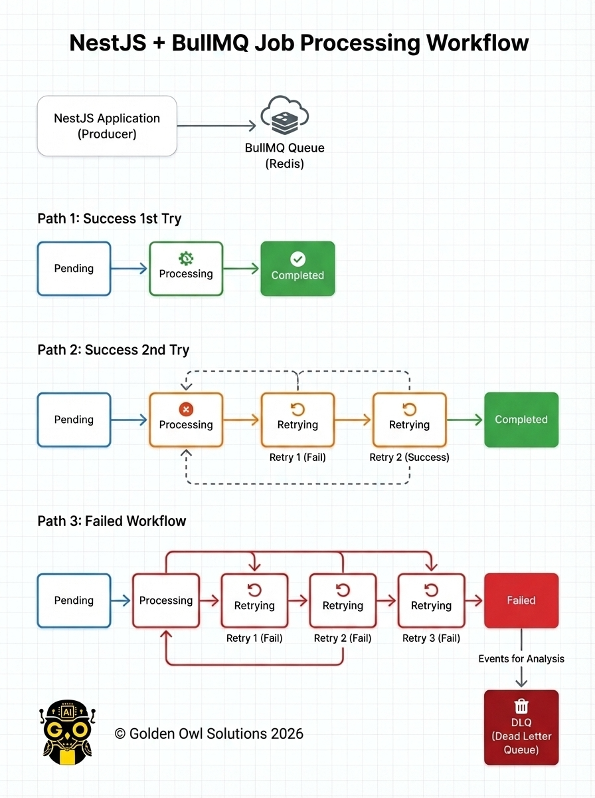
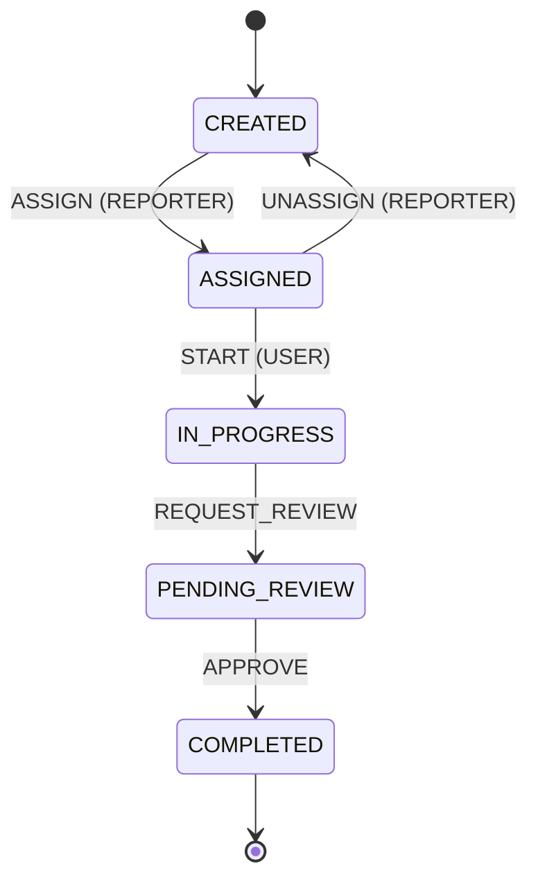

# Async event flow (demo)

This project is a **demo** of a **task-management SaaS**: users and reporters manage tasks through a defined state machine, while the API stays thin by pushing heavy work to **background jobs**.

**Asynchronous processing** uses **Redis** and **BullMQ**. Two workers run in parallel:

- **Task worker** — subscribes to `task-processing-queue`. It creates new tasks in the database from queued events, updates event status (`processing` → `completed` or `failed`), and hands off notification work to the mail queue. Failed jobs are retried with backoff; repeated failures are logged and can trigger a failure email.
- **Mail worker** — subscribes to `mail-processing-queue` and sends email (e.g. “task created” or “task creation failed”). With Docker Compose, **MailHog** receives mail so you can verify the flow without a real SMTP provider.

Together, this illustrates a typical pattern: **event → task creation → outbound mail**, all **off the HTTP request path**, with retries and observability suitable for a reviewer walkthrough.

## Architecture



---

## Reviewer: run the full flow (Docker only)

You need **Docker** and **Docker Compose**.

### 1. Env

```bash
cp .env.example .env
```

Defaults: API on host **3005** (`API_PUBLISH_PORT`), Postgres **5433**. If you change the port in `.env`, use it in the `curl` URLs below.

### 2. Start everything

```bash
docker compose up -d --build
```

Services: `postgres`, `redis`, `mailhog`, `api`, `worker`, `mailworker`.

### 3. Migrations (first time or empty DB)

```bash
pnpm migration:up
```

### 4. Seed (Optional, Recommend)
Loads default users and sample tasks for local development. Run **after** migrations. Safe to run more than once: existing users are skipped, and tasks are only inserted if the first seed task title is not already present.

```bash
pnpm seed
```

If the API is running in Docker (the image uses `npm`):

```bash
docker compose exec api npm run seed
```

**Users** (passwords are for local use only):

| Email | Password | Role |
|-------|----------|------|
| `user@assignment.local` | `User123!@#` | `USER` |
| `reporter@assignment.local` | `Reporter123!@#` | `REPORTER` |

Or you can register you own account

```bash
curl --location 'http://localhost:3005/api/auth/register' \
--header 'Content-Type: application/json' \
--data-raw '{
    "email": Goldenowl@gmail.com",
    "password": "GoldenOwl@Pass21",
    "role": "reporter",
    "name": "Your name"
}
```

### Task Management State machine

Transitions and allowed roles are defined in [`src/modules/task-management/state-machine/task.state-machine.ts`](src/modules/task-management/state-machine/task.state-machine.ts).



### 5. Create + Action with task (Login and Provide you own JWT token)

```bash
curl --location 'http://localhost:3005/api/task' \
--header 'Content-Type: application/json' \
--header 'Authorization: ••••••' \
--data '{
    "title": "Demo task",
    "description": "Test description",
    "dueDate": "2026-04-09T14:30:00.000Z"
}'
```

### 6. See failure + retries + logs

The create-task response (step 5) does **not** include `taskId`; it is only logged server-side. Get the UUID from either place:

- **API logs** — after the `POST /api/task` request, run `docker logs assignment-api` (or `docker compose logs api`) and find a line like `Push to queue: … for taskId: <uuid>`.
- **Task worker logs** — `docker logs assignment-worker` and find `Processing job: taskId: <uuid>`.

Replace `YOUR_TASK_ID` and use the same JWT as in step 5:

```bash
curl -sS "http://127.0.0.1:3005/api/event/YOUR_TASK_ID/failure-logs" \
  -H "Authorization: Bearer YOUR_JWT"
```

You will see **three** rows (`attempt` 1–3) only if the **task-processing** job failed on every retry (BullMQ is configured for 3 attempts). If the task was created successfully, this endpoint returns an empty list.

Check the worker:

```bash
docker logs assignment-worker
```

Look for `Failed job` lines and `Moved to DLQ` on the last attempt.

### 7. See success path

After a successful **create task** (step 5), confirm the happy path:

- **Task worker** (`docker logs assignment-worker`): you should see `Processing job: taskId: …` without repeated `Failed job` lines for that run.
- **Mail worker** (`docker logs assignment-mailworker`): look for `[mail] success taskId=…` when the notification email is sent.
- The related `Event` row in the database ends as `completed` when processing finishes.

### 8. Check received mail (MailHog)

Open **http://localhost:8025** in your browser to view notification mail send by MailHog (task notifications, failure emails, etc.).


### 9. Stop

```bash
docker compose down
```

Remove DB data: `docker compose down -v`.

---

## Run unit test

```bash
pnpm test
```


---

## Code map (for review)

- `src/main.ts`, `src/app.module.ts` — Nest bootstrap, BullMQ wiring, feature modules  
- `src/modules/auth/` — register/login, JWT, guards/strategies, `User` entity  
- `src/modules/event/` — HTTP, DTOs, service, queue jobs, `Event` entity, failure logs  
- `src/modules/task-management/` — task API and service, `Task` entity, state machine in `state-machine/task.state-machine.ts`  
- `src/modules/worker/worker.ts` — task queue consumer (`worker` Compose service)  
- `src/modules/mail-worker/` — mail queue consumer and SMTP sending (`mailworker` Compose service)  
- `src/common/` — enums, constants, base entity, pagination, shared helpers  
- `src/config/` — JWT and mail configuration  
- `src/database/` — MikroORM module, migrations, `seeders/database.seeder.ts` (`pnpm seed`)  
- `mikro-orm.config.ts` — ORM / DB connection  
- `docker-compose.yml` — Postgres, Redis, MailHog, API, task worker, mail worker  
