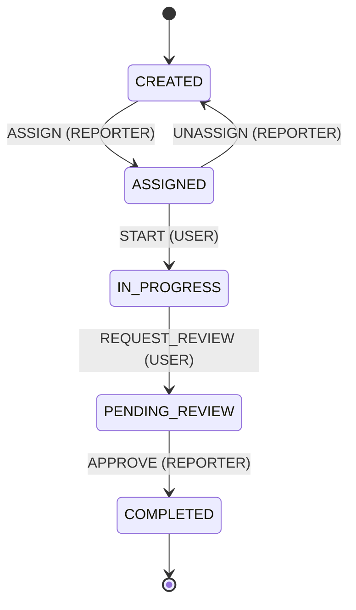

# Task Management Saas System (demo)

This project is a **demo** of a **task-management SaaS**: users and reporters manage tasks through a defined state machine, while the API stays thin by pushing heavy work to **background jobs**.

**Asynchronous processing** uses **Redis** and **BullMQ**. The Compose **`worker`** service runs one Nest worker process that hosts both queue processors:

- **Task processor** — subscribes to `task-processing-queue`. It creates new tasks in the database from queued events, updates event status (`processing` → `completed` or `failed`), and hands off notification work to the mail queue. Failed jobs are retried with backoff; repeated failures are logged and can trigger a failure email.
- **Mail processor** — subscribes to `mail-processing-queue` and sends email (e.g. “task created” or “task creation failed”). With Docker Compose, **MailHog** receives mail so you can verify the flow without a real SMTP provider.

Together, this illustrates a typical pattern: **event → task creation → outbound mail**, all **off the HTTP request path**, with retries and observability suitable for a reviewer walkthrough.

## Architecture on BullMQ


---


## Task Management State machine

Transitions and allowed roles are defined in [`src/modules/task/state-machine/task.state-machine.ts`](src/modules/task/state-machine/task.state-machine.ts).




## Set up: Run the full flow (Docker only)

You need **Docker** and **Docker Compose**.

### 1. Env

```bash
cp .env.example .env
```

Defaults: API on host **3005** (`API_PUBLISH_PORT`), Postgres **5433**. If you change the port in `.env`, use it in the `curl` URLs below.

### 2. Start everything

```bash
docker compose up -d --build
```

Services: `postgres`, `redis`, `mailhog`, `api`, `worker` (task + mail BullMQ processors).

### Explore the API in the browser (Swagger)
Access [Swagger API Doc](http://localhost:3005/api/docs#/)

### 3. Migrations (first time or empty DB)

```bash
pnpm migration:up
```

### 4. Seed (Optional, Recommend)
Loads default users and sample tasks for local development. Run **after** migrations. Safe to run more than once: existing users are skipped, and tasks are only inserted if the first seed task title is not already present.

```bash
pnpm seed
```

If the API is running in Docker (the image uses `npm`):

```bash
docker compose exec api npm run seed
```

**Users** (passwords are for local use only):

| Email | Password | Role |
|-------|----------|------|
| `user@assignment.local` | `User123!@#` | `USER` |
| `reporter@assignment.local` | `Reporter123!@#` | `REPORTER` |

Or you can register you own account

```bash
curl --location 'http://localhost:3005/api/auth/register' \
--header 'Content-Type: application/json' \
--data-raw '{
    "email": Goldenowl@gmail.com",
    "password": "GoldenOwl@Pass21",
    "role": "reporter",
    "name": "Your name"
}
```


### 5. Login

Log in with `email` and `password` to get a JWT (`accessToken`). Use a seed user from the table in step 4 or an account you registered there.

```bash
# User Login
curl -sS --location 'http://localhost:3005/api/auth/login' \
  --header 'Content-Type: application/json' \
  --data '{
    "email": "user@assignment.local",
    "password": "User123!@#"
}'
```
```bash
# Reporter Login
curl -sS --location 'http://localhost:3005/api/auth/login' \
  --header 'Content-Type: application/json' \
  --data '{
    "email": "reporter@assignment.local",
    "password": "Reporter123!@#"
}'
```

Copy `accessToken` from the JSON response. For protected routes, send `Authorization: Bearer <accessToken>` (replace the example below with your token).

### 6. Task APIs (use JWT from step 5)

#### Create

`POST /api/task` — **Reporter** only.

- Body: `title`, optional `description`, `dueDate` (ISO date-time).
- Response: `{ "message": "..." }` only — no `taskId` in the body (async creation; see step 7).

```bash
curl --location 'http://localhost:3005/api/task' \
--header 'Content-Type: application/json' \
--header 'Authorization: Bearer YOUR_JWT' \
--data '{
    "title": "Demo task",
    "description": "Task description",
    "dueDate": "2026-04-09T14:30:00.000Z"
}'
```

#### Action

`POST /api/task/action/:taskId/:action` — **User** or **Reporter** (each action enforces role + current status; invalid combo → 400/403).

Path `action`: `assign`, `unassign`, `start`, `request_review`, `approve` (see [state machine](#task-management-state-machine)).

- `assign`: body must include `userId` (assignee UUID).
- Other actions: body can be `{}`.

```bash
curl -sS -X POST 'http://localhost:3005/api/task/action/YOUR_TASK_ID/assign' \
  -H 'Content-Type: application/json' \
  -H 'Authorization: Bearer YOUR_JWT' \
  -d '{"userId":"USER_UUID"}'
```

#### List tasks

`GET /api/task?page=&pageSize=&search=`

- Defaults: `page=1`, `pageSize=10`; optional `search` filters by title (case-insensitive).
- **Users** see only tasks assigned to them; **reporters** see all.

```bash
curl -sS 'http://localhost:3005/api/task?page=1&pageSize=10' \
  -H 'Authorization: Bearer YOUR_JWT'
```

### 7. See failure + retries + logs

The create-task response (step 6) does **not** include `taskId`; it is only logged server-side. Get the UUID from either place:

- **API logs** — after the `POST /api/task` request, run `docker logs assignment-api` (or `docker compose logs api`) and find a line like `Push to queue: … for taskId: <uuid>`.
- **Worker logs** — `docker logs assignment-worker` and find `Processing job: taskId: <uuid>`.

Replace `YOUR_TASK_ID` and use the same JWT as in step 5 (login):

```bash
curl -sS "http://127.0.0.1:3005/api/event/YOUR_TASK_ID/failure-logs" \
  -H "Authorization: Bearer YOUR_JWT"
```

You will see **three** rows (`attempt` 1–3) only if the **task-processing** job failed on every retry (BullMQ is configured for 3 attempts). If the task was created successfully, this endpoint returns an empty list.

Check the worker:

```bash
docker logs assignment-worker
```

Look for `Failed job` lines and `Moved to DLQ` on the last attempt.

### 8. See success path

After a successful **create task** (step 6), confirm the happy path:

- **Worker** (`docker logs assignment-worker`): you should see `Processing job: taskId: …` without repeated `Failed job` lines for that run, and `[mail] success taskId=…` when the notification email is sent.
- The related `Event` row in the database ends as `completed` when processing finishes.

### 9. Check received mail (MailHog)

Open **http://localhost:8025** in your browser to view notification mail send by MailHog (task notifications, failure emails, etc.).


### 10. Stop

```bash
docker compose down
```

Remove DB data: `docker compose down -v`.

---

## Run unit test

```bash
pnpm test
```


---

## Code map (for review)

- `src/main.ts`, `src/app.module.ts` — Nest HTTP API bootstrap; imports `BullRootModule` and feature modules (`Auth`, `Event`, `Task`)  
- `src/bull/` — BullMQ root module and Redis connection (`bull-root.module.ts`, `bull.config.ts`)  
- `src/modules/auth/` — register/login, JWT, guards/strategies, `User` entity  
- `src/modules/event/` — HTTP, DTOs, service, queue jobs, `Event` entity, failure logs  
- `src/modules/task/` — task HTTP API, commands/queries, `Task` entity, state machine in `state-machine/task.state-machine.ts`, task queue name + `task.processor.ts`  
- `src/modules/mail/` — mail queue, `mail.processor.ts`, SMTP sending via `mail.service.ts`  
- `src/worker.ts`, `src/worker.module.ts` — standalone worker entrypoint (`pnpm worker` / Compose `worker` → `dist/src/worker.js`)  
- `src/processors/processors.module.ts` — registers BullMQ **task** and **mail** processors and their queues for the worker process  
- `src/common/` — enums, constants, base entity, pagination, shared helpers  
- `src/config/` — JWT and mail configuration  
- `src/database/` — MikroORM module, migrations, `seeders/database.seeder.ts` (`pnpm seed`)  
- `mikro-orm.config.ts` — ORM / DB connection  
- `docker-compose.yml` — Postgres, Redis, MailHog, API, worker (task + mail processors)  
